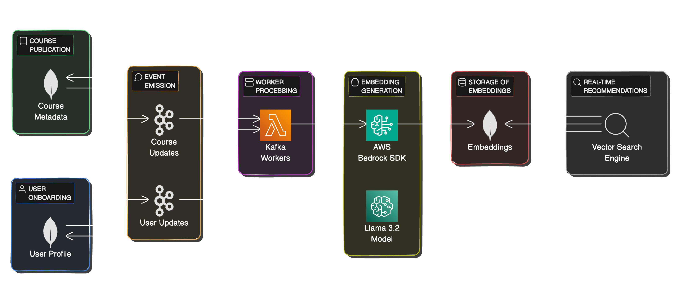

# **Personalized Course Recommendation System Using RAG with AWS Bedrock and MongoDB**

This document details the setup, architecture, and code for building a personalized course recommendation system using Retrieval-Augmented Generation (RAG). The system leverages LangChain.js to streamline interactions with AWS Bedrock (for large language model embeddings) and MongoDB 8.0 with vector search indexing. The recommendation system provides users with tailored course suggestions based on their skill level and interests.

## **Table of Contents**
1. Overview
2. System Architecture
3. Technologies Used
4. Aggregation and Vector Search Indexing
5. Sample Code
6. How it Works
7. References

## **1. Overview**
The personalized course recommendation system is built to:

- **Onboard Users**: Collect detailed profile data, including coding skills, level, and preferences.
- **Publish Courses**: Each course includes metadata such as difficulty level, relevant topics, and skills.
- **Emit Events**: Updates to user profiles or new courses publish events via Kafka.
- **Embed User and Course Data**: AWS Bedrock generates embeddings for both user profiles and course metadata.
- **Store and Query Embeddings**: MongoDB’s vector store efficiently stores embeddings and uses cosine similarity to retrieve top matches for personalized recommendations.



## **2. System Architecture**
Here’s an overview of the system components and workflow:

### **User and Course Management:**
- **User Profile**: Detailed user attributes, such as skill level and preferences, are stored in MongoDB.
- **Course Metadata**: Each course includes fields that support accurate recommendations.

### **Event Emission:**
- **Kafka Events**: Changes in user profiles and course updates are published to Kafka.
- **Kafka Workers**: Workers listen for these events, retrieve the relevant data, and process embeddings.

### **Embedding and Storage:**
- **LangChain.js and Bedrock**: Using `@langchain/community` and `@langchain/aws` packages, embeddings are created from the AWS Bedrock SDK.
- **MongoDB Vector Storage**: Embeddings are stored in MongoDB with vector indexing for efficient retrieval based on cosine similarity.

### **Real-Time Recommendations:**
- **Vector Search**: MongoDB’s vector search efficiently retrieves course recommendations based on a user’s profile and preferences.
- **Search Engine Extension**: This approach also enables personalized search results based on user preference embeddings.

## **3. Technologies Used**
- **LangChain.js**: Facilitates integration with Bedrock for LLM and embeddings.
- **AWS Bedrock SDK**: Provides LLMs for generating embeddings and processing user/course data.
- **MongoDB 8.0 with Vector Indexing**: Supports vector search for efficient, real-time recommendations.
- **Kafka**: Streams updates for user profiles and course metadata.
- **Node.js**: The core runtime for the application.

## **4. Aggregation and Vector Search Indexing**
MongoDB supports efficient vector search indexing. Below is the configuration for setting up vector indexing in MongoDB:

### **Vector Index Configuration**
```json
{
  "fields": [
    {
      "numDimensions": 1024,
      "path": "embeddings",
      "similarity": "cosine",
      "type": "vector"
    }
  ]
}
```

### **Vector Search Query**
You can perform a vector search against the MongoDB vector store to retrieve top course recommendations:

```javascript
const vectorSearch = async (embeddings, limit = 5) => {
  const results = await db.collection('course_embeddings').aggregate([
    {
      $search: {
        index: "vector_index",  // Your vector index name
        vectorSearch: {
          path: "embeddings",  // Path to your vector field
          queryVector: embeddings,  // The vector representation of the user profile
          numCandidates: 1024,  // Number of candidate documents to consider
          limit: limit,  // Limit for the number of results returned
        }
      }
    }
  ]).toArray();

  return results;
};
```

## **5. Sample Code**

### **Event Handling with Kafka**
Here’s an example of how to emit messages to a Kafka topic when a user or course is updated:

```javascript
const Kafka = require('kafkajs').Kafka;

const kafka = new Kafka({
  clientId: 'course-recommendation-system',
  brokers: ['localhost:9092']
});

const producer = kafka.producer();

const emitUpdateEvent = async (eventType, id) => {
  await producer.connect();
  await producer.send({
    topic: 'updates',
    messages: [{ value: JSON.stringify({ eventType, id }) }],
  });
  await producer.disconnect();
};

// Usage
emitUpdateEvent('course_published', courseId);
emitUpdateEvent('user_profile_updated', userId);
```

### **Embedding Generation with AWS Bedrock**
To generate embeddings using the Bedrock SDK, you can use the following code snippet:

```javascript
import { Bedrock } from "@langchain/community/llms/bedrock"; 
import { BedrockEmbeddings } from "@langchain/aws";

const bedrock = new Bedrock();
const bedrockEmbeddings = new BedrockEmbeddings();

// Function to generate embeddings for user profile
const generateUserEmbedding = async (userProfile) => {
  const prompt = `Generate an embedding for the following user profile: ${JSON.stringify(userProfile)}`;
  const response = await bedrock.call(prompt);
  return response;
};

// Function to generate embeddings for a course
const generateCourseEmbedding = async (courseDetails) => {
  const prompt = `Generate an embedding for the following course details: ${JSON.stringify(courseDetails)}`;
  const response = await bedrock.call(prompt);
  return response;
};
```

## **6. How it Works**
The overall process for generating course recommendations based on user data is summarized in the following example function:

```javascript
async function getRecommendations(userId) {
  // Fetch user profile details (this function is assumed to be defined elsewhere)
  const userProfile = await getUserProfile(userId);
  
  // Generate user embedding
  const userEmbedding = await generateUserEmbedding(userProfile);
  
  // Execute vector search to find top course recommendations
  const recommendations = await vectorSearch(userEmbedding);
  
  return recommendations;
}
```

## **7. References**
- LangChain Documentation: [LangChain](https://js.langchain.com/)
- AWS Bedrock Documentation: [AWS Bedrock](https://aws.amazon.com/bedrock/)
- MongoDB Vector Search: [MongoDB](https://www.mongodb.com/docs/manual/core/vector-search/)
- Kafka Documentation: [Kafka](https://kafka.apache.org/documentation/)
