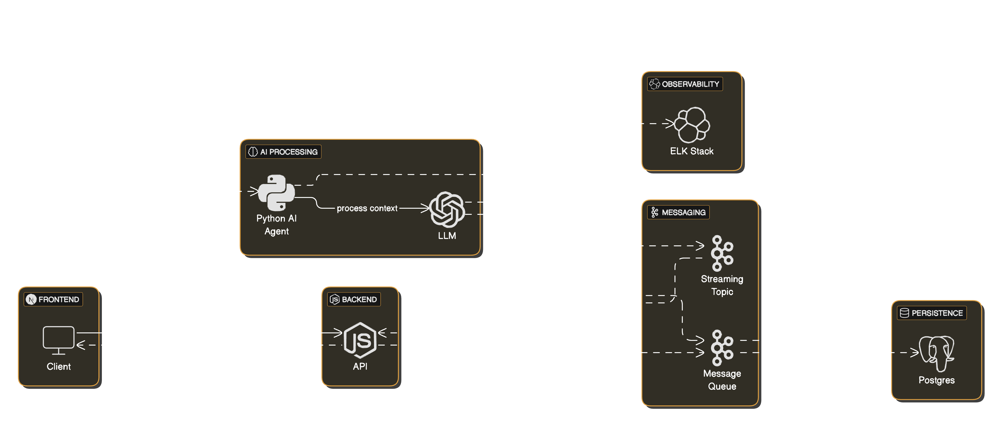

# 🏗️ Architecting Scalable, Real-Time AI Chatbots: Principles, Patterns, and Real-World Challenges

> **Why “Hello World” in a notebook is easy, but production-scale AI chatbots are a true engineering feat.**

---

## 🚀 Executive Summary

Building a chatbot demo is simple. Delivering a **real-time, context-aware, scalable AI assistant**—serving thousands or millions globally, with enterprise reliability, memory, and observability—is a vastly different challenge. This article details the **architecture, design principles, and real-world problems** you must solve to go from prototype to production.

---

## 🧩 Detailed Architecture: Layers & Components

Modern scalable chatbots are not monoliths—they are **modular, event-driven, and cloud-native**. Here’s a breakdown of the architecture:

| Layer            | Role & Technologies                                                                 |
|------------------|-------------------------------------------------------------------------------------|
| **User Interface** | Web/mobile app with SSE or WebSockets for real-time streaming                     |
| **API Gateway**    | REST/SSE endpoints (NestJS/Node.js), Kafka producer, authentication, throttling   |
| **Message Broker** | Apache Kafka (partitioned, distributed, backpressure handling)                    |
| **AI Agent Pool**  | Python microservices, Kafka consumers, LLM API integration, retrieval logic       |
| **Memory Store**   | Elasticsearch (vector search for RAG), scalable document store                    |
| **Persistence**    | PostgreSQL/MongoDB (batched inserts for efficiency)                               |
| **Monitoring**     | ELK stack (Elasticsearch, Logstash, Kibana), Prometheus, Grafana                  |
| **Orchestration**  | Docker, Kubernetes (auto-scaling, rolling updates, self-healing)                  |
| **MLOps**          | CI/CD, retraining pipelines, model registry, A/B testing                          |

---

### **System Flow**

1. **User sends a message** via the UI.
2. **API Gateway** authenticates, rate-limits, and publishes the message to Kafka.
3. **AI Agent** (Python) claims the message (Robinhood/partitioned scheduling), retrieves context from Elasticsearch (RAG), and generates a response with the LLM.
4. **Streaming**: Each token is published to a Kafka streaming topic and streamed to the frontend via SSE/WebSocket.
5. **Persistence**: Batch workers assemble tokens and persist full messages to the database and Elasticsearch every few minutes.
6. **Monitoring**: All components log to ELK; Prometheus/Grafana track metrics and health.
7. **MLOps**: Feedback and logs feed retraining pipelines and model updates.

---

## ⚙️ Key Principles Behind Scalable Chatbot Architectures

### **1. Modularity and Separation of Concerns**
- **Why:** Each component (UI, API, agent, memory, persistence) is independently deployable and upgradable.
- **How:** Microservices communicate via Kafka, not direct calls, ensuring loose coupling and resilience[3][8].

### **2. Event-Driven, Asynchronous Processing**
- **Why:** Decouples producers and consumers; absorbs traffic spikes; enables horizontal scaling.
- **How:** Kafka topics for messages, streaming, and persistence[3][2][7][8].

### **3. Statelessness and Elasticity**
- **Why:** Stateless services can scale out/in easily; state is externalized to Kafka and databases.
- **How:** Use Kubernetes for auto-scaling, rolling updates, and self-healing[3][7][8].

### **4. Retrieval-Augmented Generation (RAG)**
- **Why:** LLMs alone forget context; RAG enables memory and accurate, context-aware responses.
- **How:** Store and retrieve conversation history with vector search (Elasticsearch)[3][1][11].

### **5. Observability and Monitoring**
- **Why:** Production systems need real-time insights and fast incident response.
- **How:** Centralized logging (ELK), metrics (Prometheus), and dashboards (Grafana)[3][2][8].

### **6. Write Optimization and Cost Efficiency**
- **Why:** Direct DB writes per message don’t scale; batching reduces IOPS and costs.
- **How:** Batch persistence (every 1-2 minutes) for chat history and memory[2][7][13].

### **7. Security and Compliance**
- **Why:** Chatbots process sensitive data; must meet GDPR, HIPAA, and enterprise security standards.
- **How:** Encryption, authentication, regular audits, and compliance checks[4][9][14].

### **8. MLOps and Continuous Improvement**
- **Why:** LLMs and retrievers evolve; pipelines must support retraining, versioning, and A/B testing.
- **How:** CI/CD for models and code, feedback loops, automated retraining[3][10].

---

## 🛑 Real-World Deployment Problems (and Solutions)

### **1. Integration Complexity**
- **Problem:** Connecting to legacy CRMs, ERPs, and internal APIs is slow and error-prone[4][14].
- **Solution:** API-driven microservices, robust middleware, and early IT involvement[4][14].

### **2. Data Security & Compliance**
- **Problem:** Risk of data breaches, regulatory fines, and loss of user trust[4][9][14].
- **Solution:** Strong encryption, secure storage, multi-factor authentication, and compliance audits[4][9][14].

### **3. Scalability Bottlenecks**
- **Problem:** Monolithic or synchronous designs choke under high load[2][7][8].
- **Solution:** Distributed, event-driven microservices with auto-scaling and load balancing[2][7][8].

### **4. Language and Understanding Gaps**
- **Problem:** LLMs misinterpret slang, technical terms, or multi-part queries[5][12][14].
- **Solution:** Diverse, high-quality training data; continuous NLP tuning; fallback to human agents[5][12][14].

### **5. User Engagement and Retention**
- **Problem:** Bots feel repetitive, robotic, or slow—users drop off[5][12][14].
- **Solution:** Personalization, fast streaming responses, context retention, and UI/UX best practices[5][12][14].

### **6. Cost Management**
- **Problem:** Infrastructure costs balloon as user base grows[10][13].
- **Solution:** Batching, caching, cloud auto-scaling, and careful resource allocation[2][7][8][13].

### **7. Monitoring and Incident Response**
- **Problem:** Failures go undetected, leading to outages or degraded service[2][3][8].
- **Solution:** Centralized logging, real-time metrics, alerting, and health checks[2][8].

### **8. Managing Expectations and Scope**
- **Problem:** Overpromising AI capabilities leads to disappointment and scope creep[4].
- **Solution:** Set realistic goals, phased rollouts, and clear stakeholder communication[4].

---

## 🏆 How This Architecture Solves Real-World Challenges

| Challenge                    | Architectural Solution                                                   |
|------------------------------|--------------------------------------------------------------------------|
| Integration                  | API-first, modular microservices                                         |
| Security & Compliance        | Encryption, authentication, compliance audits                            |
| Scalability                  | Kafka, Kubernetes, stateless microservices, auto-scaling                 |
| Reliability                  | Event-driven, distributed, self-healing systems                          |
| Language Understanding       | RAG, diverse training data, fallback logic                               |
| Cost Control                 | Batched writes, caching, auto-scaling, cloud-native deployment           |
| Monitoring                   | ELK, Prometheus, Grafana, real-time alerting                             |
| Continuous Improvement       | MLOps pipelines, retraining, A/B testing                                 |
| User Engagement              | Streaming UI, personalization, context-aware responses                   |

---

## 🧠 Conclusion: Architecting for Scale, Reliability, and Delight

**Production-grade AI chatbots are engineered—never just “deployed.”**  
By following these principles and patterns, you can deliver chatbots that are:

- **Scalable:** Ready for millions of users, not just demos.
- **Reliable:** Always-on, self-healing, and observable.
- **Contextual:** Remembering and adapting to every user.
- **Cost-Efficient:** Optimized for cloud, traffic, and storage.
- **Continuously Improving:** MLOps-ready for the future.

---

> _“Don’t just build AI. Build AI that scales, delights, and endures.”_

---

**#AIChatbot #SystemDesign #ScalableArchitecture #Kafka #Kubernetes #ELK #MLOps #RAG #ChatbotDeployment #Observability #Security #CloudNative**
