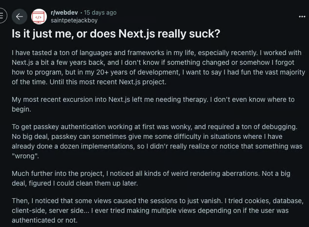

# Is Next.js Still Developer-Friendly in 2025? Exploring Issues, Vercel Monopoly, Migrations, and the Upcoming Next.js 16

In the ever-evolving React ecosystem, Next.js has been a powerhouse for building modern web apps. But as we hit 2025, developers are increasingly vocal about its growing pains. From complexity overload to Vercel's tightening grip on frontend, cloud, and AI tools, is Next.js losing its developer-friendly charm? This article combines insights from community debates, real-world migrations, and recent facts—including the buzz around the upcoming Next.js Conf on October 22, where Next.js 16 is expected to be unveiled. We'll dissect the issues, Vercel's monopoly, high-profile migrations, and what the future might hold.

## Table of Contents
- What Made Next.js Developer-Friendly Initially?
- Signs of Frustration: Complexity and Breaking Changes
- The Vercel Monopoly: Issues in Frontend, Cloud, and AI
- Key Challenges: i18n, Routing, and Authentication
- Validating Concerns: Vulnerabilities and Developer Sentiment
- Case Studies of Migrations from Next.js
- Framework Analysis: Pros, Cons, and Complexity
- When Next.js Still Shines—and Top Alternatives
- Looking Ahead: Next.js 16 and the Upcoming Conference
- Conclusion: Is Next.js Worth the Hassle in 2025?

## What Made Next.js Developer-Friendly Initially?
Next.js started as a breath of fresh air for React developers tired of manual setups. It eliminated the need for custom Webpack configs and SSR workarounds, offering:

- **Zero-Config Setup**: `npx create-next-app` delivers SSR, SSG, code splitting, and hot reloading instantly.
- **File-Based Routing**: Simple file placement in `/pages` creates routes—no extra configs.
- **Automatic Optimizations**: Built-in image handling, CSS bundling, and performance boosts without deep dives.
- **Straightforward Docs**: Early documentation was practical, making it feel like enhanced React for real products.

This approach made Next.js a go-to for everything from static sites to dynamic apps.

## Signs of Frustration: Complexity and Breaking Changes
Fast-forward to 2025, and Next.js has morphed into a full-stack behemoth. Major releases bring breaking changes, requiring app rewrites annually. The shift to React Server Components (RSC) and the App Router has blurred client-server lines, causing hydration mismatches and debugging woes. Community forums like Reddit and X are filled with complaints about the "complexity tax," where abstractions hide issues until they break in production.

Documentation, once concise, now feels like a constant companion for navigating dual routers or data-fetching patterns.

## The Vercel Monopoly: Issues in Frontend, Cloud, and AI
A core grievance is Vercel's dominance. As the creators of Next.js, Vercel optimizes the framework for its hosting platform, creating perceived vendor lock-in. Features like edge functions and ISR shine on Vercel but falter elsewhere, complicating self-hosting and inflating costs—bills can hit $200+/month for modest sites.

This extends beyond frontend: Vercel's cloud services tie into Next.js deployments, while tools like v0 (AI-powered UI generation) and the AI SDK push developers into an ecosystem where alternatives feel second-class. Developers report issues like limited scalability without Vercel, opaque pricing, and forced migrations due to incompatibilities. In AI-integrated apps, this monopoly stifles innovation, as non-Vercel setups require extra workarounds, eroding developer freedom and raising antitrust whispers in the community.

## Key Challenges: i18n, Routing, and Authentication
Validated through searches and reports, these pain points highlight systemic issues:

- **i18n Integration**: Built-in support exists, but config limits cause build-time slowdowns. Mixing with the App Router leads to client-server errors; libraries like i18next are band-aids, not fixes.

- **Routing Problems**: Coexisting Pages and App Routers confuse teams. Bugs include failing `<Link>` components and excess re-renders, slowing apps and migrations.

- **Authentication with Auth.js (formerly NextAuth)**: Prone to session drops in production, middleware conflicts, and version mismatches. Many switch to Clerk for reliability.

These stem from abstractions that prioritize Vercel's ecosystem over broad usability.

## Validating Concerns: Vulnerabilities and Developer Sentiment
Cross-checks confirm the hype:

- **CVE-2025-29927**: A March 2025 middleware vulnerability allowed auth bypasses, patched swiftly but exposing risks in complex setups.
- **Developer Sentiment**: 2025 polls show a divide—praise for SEO/edge rendering, but gripes over slow builds and errors. X posts lament Vercel's influence, with calls for better self-hosting docs.

## Case Studies of Migrations from Next.js
Migrations underscore these frustrations:

### OpenAI's ChatGPT to Remix (2024)
ChatGPT, a massive SPA, switched for better client performance and deployment flexibility. Next.js's SSR focus added overhead; Remix's web standards and Vite integration cut load times and avoided Vercel ties. Outcomes: Smoother navigation, no outages.

### Northflank to Custom React + Express (2025)
Frustrated by slow SSR (200-700ms renders) and SEO drops, Northflank rebuilt with plain React/Express. Vercel coupling caused crashes and high costs; the switch boosted speeds 50x and restored rankings.

### Development Team to Vite (2024)
A team cited vendor lock-in, dev server lags, and RSC bugs. Vite offered faster refreshes and ecosystem freedom, simplifying debugging.

Common threads: Overhead for non-SSR apps, cost/flexibility issues, and complexity eroding trust.

## Framework Analysis: Pros, Cons, and Complexity
| Requirement          | Next.js Solution                          | Complexity Level | Pain Points                          |
|----------------------|-------------------------------------------|------------------|--------------------------------------|
| Routing             | File-based (Pages/App Router)            | 🟡 Medium       | Dual systems, migration confusion   |
| SSR/SSG             | Built-in strategies (ISR, etc.)          | 🔴 High         | Hydration errors, debugging         |
| Build Tooling       | Webpack/Turbopack, zero-config           | 🟢 Low          | Custom tweaks are tricky            |
| Data Fetching       | getServerSideProps, Server Components    | 🟡 Medium       | Multiple patterns overwhelm         |
| Authentication      | Third-party (Auth.js)                    | 🔴 High         | Session issues, production bugs     |
| Performance         | Auto-optimizations, Core Web Vitals      | 🟡 Medium       | Opaque; good but hard to debug      |
| Deployment          | Vercel-optimized                         | 🟡 Medium       | Self-hosting hurdles, cost spikes   |

*Legend: 🟢 Low, 🟡 Medium, 🔴 High.*

## When Next.js Still Shines—and Top Alternatives
Next.js excels for SEO-driven or content-heavy sites, where file-based routing empowers teams. But for SPAs or cost-conscious projects, consider:

- **Remix**: Transparent, web-fundamentals focus.
- **SvelteKit**: Lightweight SSR.
- **Astro**: Minimal JS for static sites.
- **Vite + React Router**: Pure frontend speed.
- **Others**: Nuxt.js or Laravel/Inertia.js.

## Looking Ahead: Next.js 16 and the Upcoming Conference
Excitement builds for Next.js Conf on October 22, 2025, in San Francisco, where Next.js 16 is slated for announcement. Previews hint at Turbopack stabilization, enhanced caching, routing fixes, and debugging tools—potentially addressing criticisms. Next.js 15.5's deprecations prep for this Q4 release. Could it ease Vercel dependency and complexity? Community hopes for stability and better self-hosting.

## Conclusion: Is Next.js Worth the Hassle in 2025?
Next.js remains powerful but increasingly developer-unfriendly due to complexity, breaking changes, and Vercel's monopoly stifling choice. Migrations like ChatGPT's show viable paths out, yet for teams invested, it delivers. Next.js 16 could pivot toward user needs—or risk more defections. Evaluate your stack carefully.

*About the Author: Ishan Singla is an MLOps Engineer with experience in web frameworks and scalable apps. Connect on LinkedIn.*

*SEO Keywords: Next.js issues 2025, Vercel monopoly frontend cloud AI, Next.js migrations, Next.js 16 announcement, Next.js Conf 2025, Next.js alternatives*